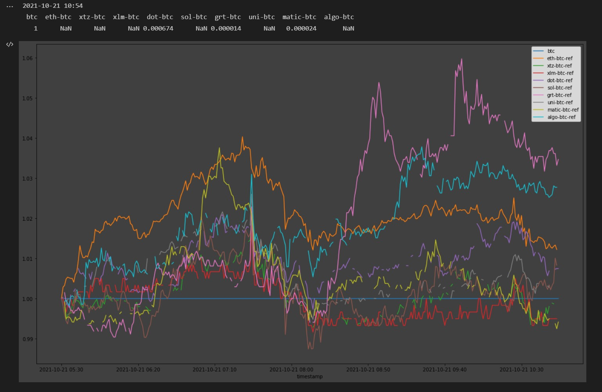
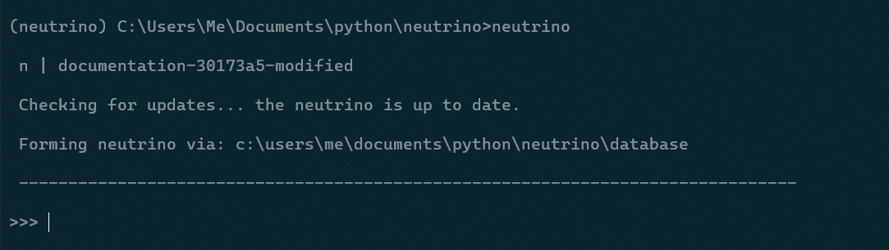
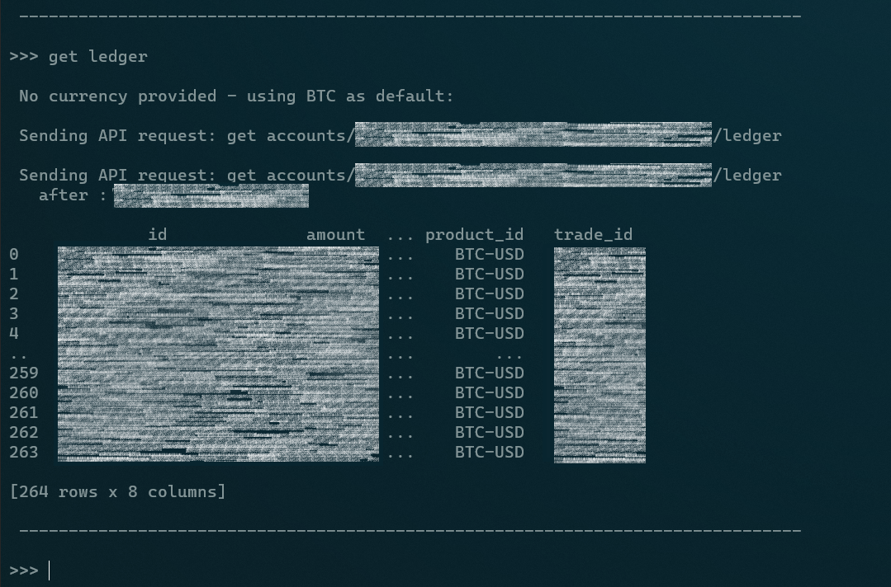
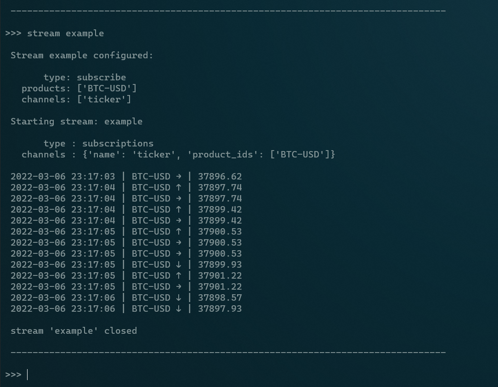

Overview
--------

The **neutrino** is a prototype framework that creates custom cryptocurrency tracking charts and executes \
data-driven orders via the Coinbase Pro platform. **It is currently under development.**

The first goal of this program is to provide actionable views that are not readily available \
on most of the major exchanges, such as:

   1. What is my total cost basis for X currency in terms of USD, considering all historical trades on this account \
      (including crypto-to-crypto transactions)? What is my overall gain/loss given the current market prices?  

   2. What is the gain/loss of X currency's value *from the perspective of Y point in time*? \
      Popular views show the 24-hour delta, but this moving window can lead to misleading reports. \
      For example, a currency may show an increasingly positive 24-hour delta despite a present decline \
      in price, provided there was a more servere drop 24 hours ago and a subsequent recovery in between.

   3. How are XYZ currencies performing *relative to each other, from the perspective of Y point in time*?

These are relatively simple examples, but one can imagine the usefulness of this data as a starting point \
for constructing meaningful portfolio trackers and trading algorithms. At the risk of derailing this high-level \
overview, here's a simple prototype view that shows the performance of various currencies relative to BTC \
using a fixed frame of reference:

   Prototype notebook view of currency performance relative to BTC using a fixed frame of reference.

This kind of view gives a clear apples-to-apples performace comparison across currencies, and eliminates the \
moving window problem by using a fixed reference point in time. This particular chart is useful for traders who \
prefer BTC over fiat.

Development Approach
====================

Formation of the **neutrino** is taking place across three phrases. It is currently in **Phase 1**, \
as is evident by its lack of unit tests and meaningful documentation:

   Phase 1 - Initial development
      * Framework and tooling
      * Data pulling features
      * Prototype CLI
      * Unit tests and documentation
   
   Phase 2 - Reporting and analytics
      * Local database configuration
      * Analytics tooling
      * Reporting views and features
      * User manual

   Phase 3 - Data-driven actions
      * Data posting features
      * Trading algorithms and implementation

Prototype Example Screenshots
=============================

   Initialization of the **neutrino**. Repository metadata are displayed, and a ``git fetch`` command is executed \
   in the background to check for updates. Data can be loaded via fresh API calls, or from a local database. \
   In this case, the latter is used.

.. figure:: _images/screenshot-candles.png
   :width: 800 px

   BTC candle data pull as specified by a user settings file. The request is automatically \
   split into sub-requests due to Coinbase Pro API limitations. Entry point: \
   :py:obj:`Neutrino.load_product_candles<neutrino.main.Neutrino.load_product_candles>`.

   BTC ledger data pull for an authenticated account (private info redacted) \
   via paginated API requests, which are handled by \
   :py:obj:`Link.send_api_request<neutrino.link.Link.send_api_request>`.

   Websocket stream as configured by a user settings file.

screenshot of updates 

Contents
--------

.. toctree::
   :maxdepth: 1

   manual
   architecture
   api